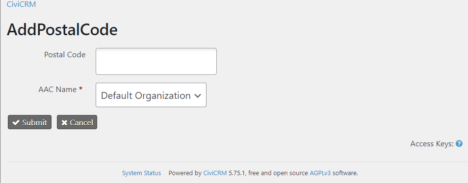
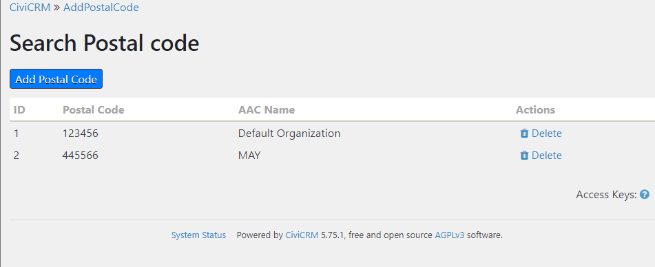

# Postal Code Extension

## Objective
- To key in the postal code range(one after one) through a form and then, to store the postal codes in the custom table
- To compare the postal code of the contact and the postal codes in the database table, and to assign the respective tag automatically to the contact

## Overview
This extension has a form named “Add Postal Code” to key in the Postal Code range(one after one) and the AAC name, and stores the postal codes within the custom database table.
- If the postal code of the contact matches with one of the postal codes in the database(postal code range), the prospect will be automatically tagged as “In_service_boundary”. 
- If not, the prospect will be automatically tagged as “Out_of_service_boundary”.

## How it works
1. Go to “Postal Code >> Add Postal Code”

2. You will appear on this page.

3. Then, Enter the postal code and Choose the related organization contact, and Submit.

4. Now, the postal code is stored in the database.

5. If the postal code of the prospect doesn’t fall within the range, contact will be tagged automatically as “Out_of_service_boundary”.

6. If not, "In_service_boundary" tag will be assigned to the contact.

7. If you want to view or delete the postal codes in the range, Go to "Postal Code >> Find Postal Code".

8. You can delete or view the range of postal codes. You can also add the postal code inside the range.

This is an [extension for CiviCRM](https://docs.civicrm.org/sysadmin/en/latest/customize/extensions/), licensed under [AGPL-3.0](LICENSE.txt).

